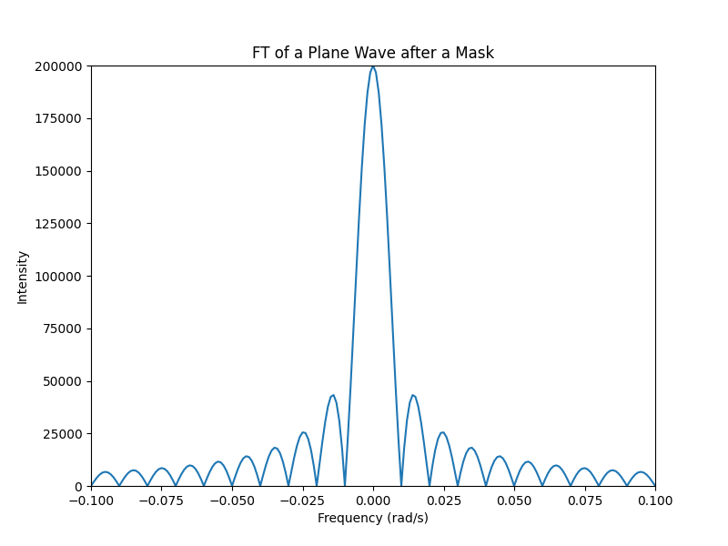
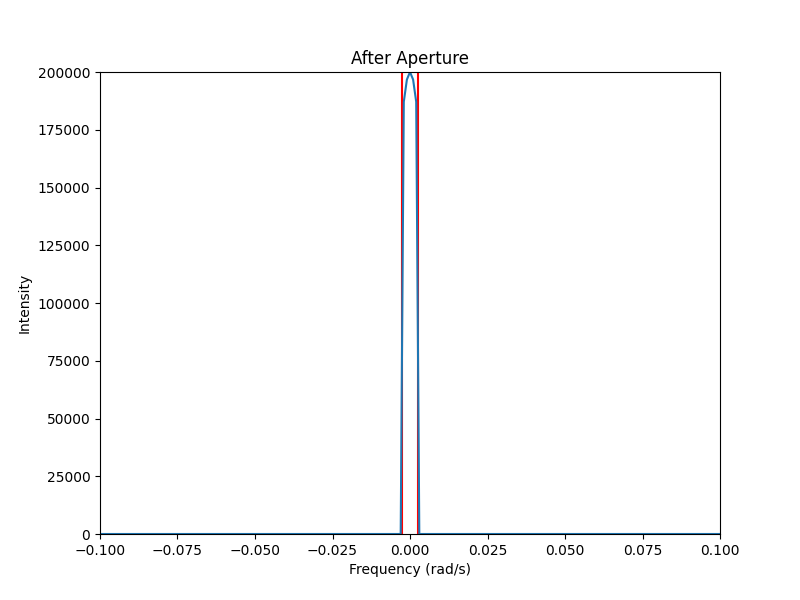
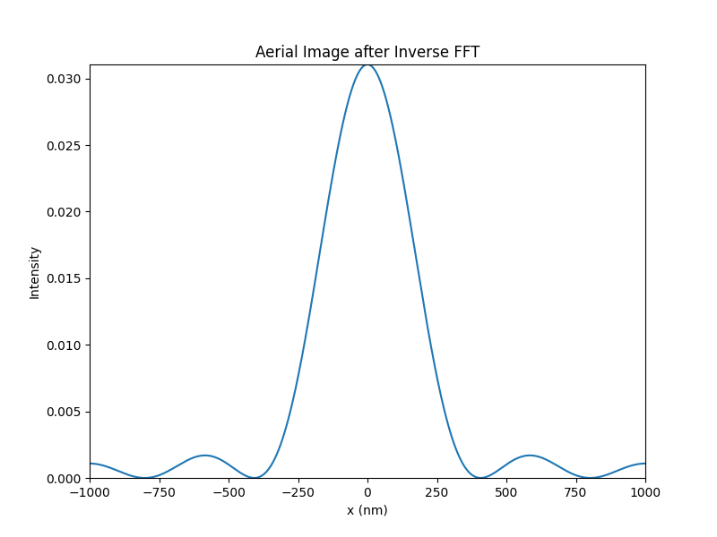

# Simulation Project

## 1D-Mask Simulation

- [x] Implementation to plot
    - The Mask
        

    - After Fourier Transformation
        
    
    - Aperture Region
        
    
    - Aerial Image
        